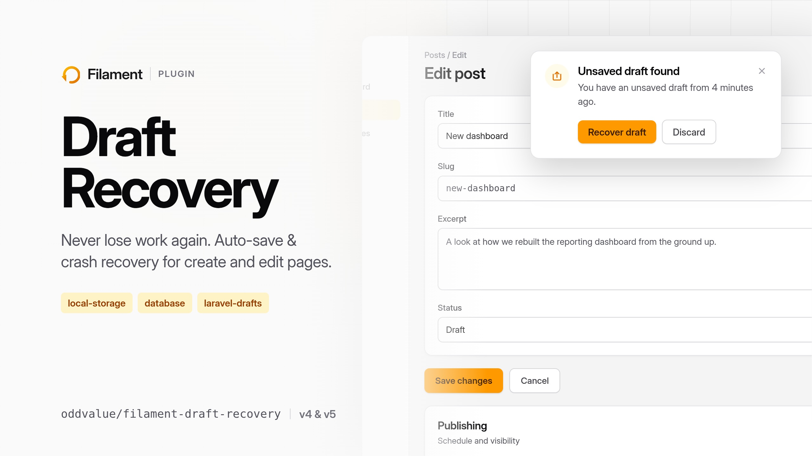

<!-- filament-hidden keeps the banner out of the plugin's page on the Filament
     website, which renders this README below its own hero image. -->
<picture class="filament-hidden">
  <source media="(prefers-color-scheme: dark)"
          srcset="art/draft-recovery-2560x1440-dark.jpg">
  <source media="(prefers-color-scheme: light)"
          srcset="art/draft-recovery-2560x1440-light.jpg">
  
</picture>


# Filament Draft Recovery

[](https://packagist.org/packages/oddvalue/filament-draft-recovery)
[](https://www.php.net/)
[](https://filamentphp.com/)
[](https://github.com/oddvalue/filament-draft-recovery/actions?query=workflow%3Atests+branch%3Amain)
[](https://github.com/oddvalue/filament-draft-recovery/actions?query=workflow%3Afix-code-style+branch%3Amain)
[](https://packagist.org/packages/oddvalue/filament-draft-recovery)
[](https://github.com/oddvalue/filament-draft-recovery/actions)

Auto-save draft & crash recovery for Filament v4 and v5 create/edit pages, with swappable storage drivers. 100% test coverage, enforced in CI.

While a user edits a create or edit form, the package snapshots the form state after each pause in typing (2 seconds by default). If the browser crashes, the tab closes, or the session expires, the next visit to that page shows a persistent notification offering to recover or discard the draft. A successful save clears the draft. Untouched drafts expire after 7 days.

## Storage drivers

| Driver | Where drafts live | Notes |
|---|---|---|
| `local-storage` (default) | The user's browser localStorage | Zero server storage; drafts are plaintext on the user's machine (see [Security](#security--sensitive-data)) |
| `database` | The `recoverable_drafts` table | Drafts follow the user across devices; payloads can be [encrypted at rest](#encrypting-database-drafts) |
| `laravel-drafts` | On the record being edited, via [oddvalue/laravel-drafts](https://github.com/oddvalue/laravel-drafts) | Each auto-save becomes the record's auto draft |

Register your own driver with `DraftRecovery::extend()`.

## Installation

```bash
composer require oddvalue/filament-draft-recovery

php artisan filament-draft-recovery:install
```

The install command publishes the config and the migrations the server-side drivers need. Skip running the migrations if you only use the `local-storage` driver.

## Usage

Add the trait to a resource's create page, edit page, or both:

```php
use Filament\Resources\Pages\CreateRecord;
use Oddvalue\FilamentDraftRecovery\Concerns\RecoversDrafts;

class CreatePost extends CreateRecord
{
    use RecoversDrafts;

    protected static string $resource = PostResource::class;
}
```

The trait injects the JavaScript via the page footer. Nothing else to wire up.

### Choosing a driver

Set the default in `config/filament-draft-recovery.php` (or `FILAMENT_DRAFT_RECOVERY_STORE`):

```php
'store' => 'database',
```

Per panel:

```php
use Oddvalue\FilamentDraftRecovery\DraftRecoveryPlugin;

$panel->plugin(DraftRecoveryPlugin::make()->store('database'));
```

Per page:

```php
class CreatePost extends CreateRecord
{
    use RecoversDrafts;

    protected ?string $draftStore = 'laravel-drafts';
}
```

### The laravel-drafts driver

```bash
composer require oddvalue/laravel-drafts
```

This driver stores edit-page drafts on the record itself, using laravel-drafts' auto draft feature. The model must use the `HasDrafts` trait, its table must have the drafts columns (including `is_auto`), and auto drafts must be enabled through `drafts.auto_drafts.enabled` in laravel-drafts' config.

- **Edit pages.** Each auto-save calls `saveAsAutoDraft()` on the record, which upserts a single working copy. It never becomes the current draft and never creates a revision. Read it back through the record's `autoDraft()` relation. The record keeps `is_current`, and intentional drafts on `$record->draft` stay untouched.
- **Create pages.** Auto drafts only exist for records that already exist, so create-page drafts go to a different store. The driver reads `laravel-drafts.create_store`, falling back to your default store, or to `database` when the default is `laravel-drafts` itself. Any driver works there, including custom ones.
- **Clearing.** A successful save or a discard calls `discardAutoDraft()`. Published rows, intentional drafts, and revision history stay as they were.
- **Saves are best-effort.** A payload that violates a column constraint, such as a required field the user has not filled yet, is skipped. The next auto-save tries again.
- **Only real table columns are persisted.** Form-only keys are dropped, and repeater and relation state is out of scope for this driver. Use `database` if you need the full form payload.

### Custom drivers

Implement `Oddvalue\FilamentDraftRecovery\Contracts\DraftStore` and register it in a service provider:

```php
use Oddvalue\FilamentDraftRecovery\Contracts\DraftStore;
use Oddvalue\FilamentDraftRecovery\Data\DraftContext;
use Oddvalue\FilamentDraftRecovery\Data\RecoveredDraft;
use Oddvalue\FilamentDraftRecovery\Facades\DraftRecovery;

class RedisDraftStore implements DraftStore
{
    public function isClientSide(): bool
    {
        return false;
    }

    public function get(DraftContext $context): ?RecoveredDraft
    {
        $payload = Redis::get($context->key);

        return $payload ? new RecoveredDraft(data: json_decode($payload, true)) : null;
    }

    public function put(DraftContext $context, array $data): void
    {
        Redis::setex($context->key, 60 * 60 * 24 * 7, json_encode($data));
    }

    public function forget(DraftContext $context): void
    {
        Redis::del($context->key);
    }
}

// In a service provider:
DraftRecovery::extend('redis', fn () => new RedisDraftStore);
```

Then select it the same way as a built-in driver: `'store' => 'redis'` in the config, `DraftRecoveryPlugin::make()->store('redis')` on the panel, or `protected ?string $draftStore = 'redis';` on the page.

Every method receives a `DraftContext`. Its `key` is unique per user, panel, resource, operation, and record, which is all a key/value store needs. It also carries the page's `modelClass`, `operation` (`create` or `edit`), `record` on edit pages, and `userId`.

### Save debounce

An auto-save fires once the user has stopped typing for `save_debounce_milliseconds` (default 2000). Change it in the config:

```php
'save_debounce_milliseconds' => 5000,
```

Or per page:

```php
protected function draftRecoverySaveDebounceMilliseconds(): int
{
    return 5000;
}
```

### Security & sensitive data

Drafts are snapshots of raw form state. With the default `local-storage` driver they sit in plaintext in the browser's localStorage. Anyone with access to the machine, the browser profile, or any script running on the page can read them. No client-side scheme changes that. Treat `local-storage` as fit for non-sensitive form data only, and point resources that handle sensitive data at a server-side driver:

```php
protected ?string $draftStore = 'database';
```

Safeguards that apply out of the box:

- **Password inputs are never drafted.** The trait finds every `TextInput` with `->password()` in the form schema and excludes it, in every driver.
- **Common sensitive keys are excluded by default.** The `excluded_fields` config ships with `password`, `password_confirmation`, `current_password`, `token`, `api_token`, and `secret`.
- **Other users' leftovers are pruned.** When a draft-enabled page loads, it removes any localStorage draft that belongs to a different user of the same browser.
- **Logout purge.** An explicit logout (Laravel's `Logout` event) queues a short-lived cookie. The next panel page render, normally the login redirect, then clears every localStorage draft the package has written. The `purge_on_logout` config controls this and is on by default, so drafts do not outlive a logout on a shared machine. Session expiry fires no `Logout` event, so drafts from an expired session stay recoverable. Server-side drafts are unaffected either way.

### Excluding fields

Exclusions come from two places, merged together, and apply to every driver. Globally, in the config:

```php
'excluded_fields' => [
    // ...the defaults above,
    'billing.card_number',
    'members.*.ssn',
],
```

Per page, additive to the config:

```php
protected function draftRecoveryExcludedFields(): array
{
    return ['internal_notes', 'items.*.access_code'];
}
```

Patterns use dot notation to reach nested state; `*` matches a single segment, such as repeater or builder item keys.

### File uploads

When a user picks a file in a `FileUpload` field, Livewire moves the bytes to its temporary upload disk straight away. The form state only holds a marker pointing at that temporary file. Whether a draft can bring a pending, not yet saved upload back depends on the driver.

- **Server-side drivers** (`database` and custom stores) keep the markers in the draft. At recovery time the trait checks each marker against Livewire's temporary upload disk. If the file is still there, the upload comes back as a pending upload and saves as normal when the form is submitted. If Livewire has already pruned it, that one upload is dropped and the rest of the draft still recovers.
- **`local-storage`** always strips the markers. The browser cannot check whether the server-side temporary file still exists, and restoring a dead marker would break the upload field.
- **`laravel-drafts`** keeps only the model's real table columns. Pending upload state never matches a column, so this driver drops pending uploads.

None of this touches files already attached to the record on edit pages. Those are stored paths, not temporary markers, and they survive drafting every time.

**Limitations**

- Livewire's temporary file lifetime bounds the recovery window for pending uploads, not `expiry_days`. On local disks Livewire deletes temporary uploads older than 24 hours, and the cleanup runs whenever a new upload happens. On S3 you set expiry with a bucket lifecycle rule. A draft recovered after that restores everything except its pending uploads.
- The draft references Livewire's temporary file and does not copy the bytes. On multiple servers the temporary upload disk (`livewire.temporary_file_upload.disk`) has to be shared, S3 for example, or recovery cannot find the file.

### Encrypting database drafts

The `database` driver stores payloads as plain JSON by default. To encrypt them at rest with Laravel's `encrypted:array` cast and your app key:

```php
'database' => [
    'model' => RecoverableDraft::class,
    'encrypt' => true,
],
```

The `payload` column must be a text-type column, because ciphertext does not fit a MySQL `json` column. The shipped migration uses `longText`. If you published an earlier version of the migration that used `json`, change the column type before turning encryption on.

## Pages with their own footer

The trait renders its JavaScript component from `getFooter()`. If your page overrides that method, include the view returned by `Oddvalue\FilamentDraftRecovery\Concerns\RecoversDrafts::getFooter()` in your footer.

## How it works

- The Alpine component injected through the page footer snapshots the Livewire form state (`$wire.data`) on input and change events, debounced by `save_debounce_milliseconds` (default 2 seconds).
- With `local-storage` the draft stays in the browser. With a server-side driver the component sends the payload to the page through a Livewire call.
- On return, a draft that differs from the current form state triggers a persistent Filament notification with Recover draft and Discard actions. Recovery merges the draft over the current form state.
- On a successful save the page dispatches `draft-recovery-clear`, which removes the draft and stops the auto-save timers.
- Drafts expire after `expiry_days` (default 7). On page load the component prunes expired localStorage entries and entries belonging to other users of the same browser. Logging out purges all of them (see [Security](#security--sensitive-data)).
- With a server-side driver, pending file uploads are drafted as Livewire temporary upload markers and checked against the temporary upload disk at recovery time (see [File uploads](#file-uploads)).

## Testing

```bash
composer test
```

## Credits

Inspired by the [auto-save draft & crash recovery Filament example](https://filamentexamples.com/project/auto-save-draft-crash-recovery), reworked around client-side storage and swappable drivers. Started from the [Filament plugin skeleton](https://github.com/filamentphp/plugin-skeleton).

## License

MIT. See [LICENSE.md](LICENSE.md).
